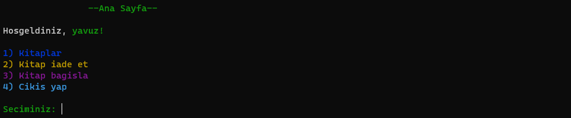

# Kütüphane Otomasyon Sistemi

## Genel Bakış
Bu proje, İleri Programlama Teknikleri dersi için geliştirilmiş, C dilinde yazılmış basit bir Konsol tabanlı Kütüphane Otomasyon Sistemidir. Kullanıcıların, kitap ödünç alma, okuma, iade etme ve bağış yapma gibi işlevlere erişimini sağlar.

## Ekran Görüntüleri

## Özellikler
- Kullanıcı Doğrulama: Farklı kullanıcı tipleri (Öğrenci, Eğitmen, Yönetici) için giriş ve kayıt desteği.
- Kitap Yönetimi: Kullanıcıların kitapları ödünç almasına, iade etmesine ve okumasına olanak tanır. Ayrıca kitap bağışı yapma desteği de bulunmaktadır.
- Renkli Konsol Arayüzü: Konsolda renkli metin gösterimi için ANSI kaçış kodlarını kullanır.
- Dosya İşleme: Metin dosyalarından kitap içeriğini okur, basit bir e-okuma deneyimi sağlar.

## Kullanımı
- Uygulamayı Başlatın: Uygulamayı bir konsol ortamında çalıştırın. Ana menüde sistem hakkında bilgi almak, giriş yapmak veya kayıt olmak için seçenekler sunulur.
Kullanıcı Kaydı: Yeni kullanıcılar, kullanıcı adı, şifre ve kullanıcı rolü ile kayıt olabilir.
- Giriş Yapma: Kullanıcılar, rollerine göre kimlik bilgileri ile giriş yapabilirler.
Kitaplarla Etkileşim: Giriş yapan kullanıcılar kitaplara göz atabilir, mevcut olanları ödünç alabilir, ödünç aldıkları kitapları okuyabilir ve iade edebilirler. Ayrıca, kullanıcılar kütüphaneye kitap bağışında bulunabilirler.

## Sistem Gereksinimleri
Windows İşletim Sistemi (bazı fonksiyonlar için windows.h kullanır, örneğin Sleep()).
C Derleyici (GCC, Clang vb.)

## Kurulum ve Derleme
- Depoyu Klonlayın: Kaynak kodunu depodan klonlayın veya indirin.
- Kodu Derleyin: C derleyicisi kullanarak kaynak kodunu derleyin. Örneğin, GCC kullanarak:
    - `gcc -o kutuphane_sistemi kutuphane_sistemi.c`
- Uygulamayı Çalıştırın: Derlemeden sonra oluşturulan uygulamayı çalıştırın:
    - `./kutuphane_sistemi`

## Katkıda Bulunma
Bu projeye katkıda bulunmak isteyenler hoş karşılanır. Lütfen deponuzu çatallayın (fork) ve değişikliklerinizle birlikte bir çekme isteği (pull request) gönderin.